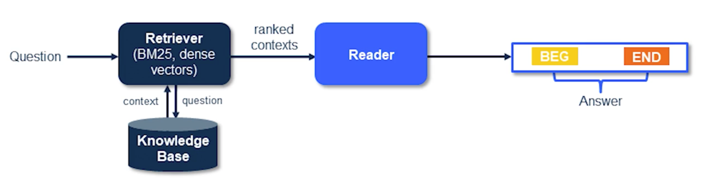

# Module 11: Open-Domain Question Answering

# What is it?

- **Question Answering:** Build CPU systems that automatically answer questions posed by humans in a natural language
- **Open-Domain:** Deal with questions about nearly anything, usually rely on general ontologies and world knowledgeable
- **Open-domain QA** involves answering questions using a **large collection of diverse documents**. Unlike domain specific QA, which focuses on a narrow topic, open-domain QA aims to tackle questions across various subjects
- The goal is to retrieve relevant information from a vast knowledge corpus without relying on explicit evidence provided in the question itself

## Formats in Question Answering

- Search engines act as. a QA tool
    - Take a keyword as input and return a webpage as an answer
- Question answering can be of different formats:
    - Multiple choice question answering
    - Span selection
        - Refers to the process of identifying and extracting relevant answer spans from a large corpus of text passages
    - Cloze
        - In Cloze-style question-answering, specific words or phrases are masked, and the system must predict the missing information based on context
            - This approach is commonly used for anonymizing named entities or sensitive information while still allowing the model to generate relevant answers
        - ***Entities are anonymized to prevent co-occurence***
        - ***Entities are answers to the passages provided in the article summaries as context***
    - Information Extraction (unstructured sources)

## Classical QA Pipeline

1. Detailed question analysis
2. Multi-stage answer generation
3. Filtering of question and answer texts
4. Scoring of answer candidates w.r.t. questions
5. Ranking the answer candidates

## Two-Stage Retriever Reader

1. Retrieve documents for a given question
2. Read and rank the documents and their corresponding answers in a single phase

# Retriever Reader

- **Input:** A set of descriptive documents and a question
- **Output:** An answer extracted from the descriptive documents
- **The framework is setup in two stages:**
    1. **Information Retrieval:** Candidate documents are retrieved for a given input question
    2. **Reading comprehension:** Candidates are parsed for suitable answers

## Retriever Stage

- **Vanilla Setting**
    - TF-IDF weight term vector can be used to retrieve relevant documents for an input question
    - Such a retriever need not be trained, thus easily scale to new domains or add new documents in an incremental fashion
- **Retrieval Phase:** could return either entire documents or constituent paragraphs of a document

## Reading Comprehension Stage

- Parsing the documents and extracting an answer could be considered a reader comprehension problem
- **Input:**  Includes retrieved paragraph or entire document (from previous step) and question
- **Output:** An answer (text span) extracted from the paragraph or document

## Basic Reader Model with Document Attenion

- Jointly encode document and the question to extract an answer span

    

    

# Training An Answer Re-Ranker

- **How do we re-rank them?**
    1. If an answer candidate is supported by multiple pieces of evidence, then the answer is likely to be correct
    2. One answer candidate is more likely to be an answer if the union of its evidence covers most information in the question
- ***Every passage returns a candidate answer***

# Open-Domain Question Answering: Training Methods

## Multi-Passage Training

- **SharedNormalization:** In a mini-batch, each passage is processed independently, and span probability is computed across spans
- Utilizing the non-answer paragraphs is found to be beneficial
- Global normalization for making QA model more stable

## Passage Re-Ranker

- Deep re-ranker helps in refining the retrieved passages
- Retriever returns N passages and ranker helps select the best passage overall
- ***Re-ranker is trained using distant supervision***
    - Passages with answers and now answers

    

## Joint Training of Reader-Ranker

- IR model retrieves the top N passages conditioned on the question
- Ranker and Reader are trained jointly using REINFORCE to optimize the expectation of the labeled answer from the passage
- Reader params are updated using Backprop
- Ranker params are updated via policy gradient using a bounded reward which captures accuracy of an answer  extracted by the Reader
- At inference, ranker and reader are combined

# Sparse Vs. Dense Representation for Retrieval

- Sparse Representation: $[0,1,0,0,0,0,....]$
- Dense Representation: $[2.9, 3.5, -1.1,...]$
- **Sparse:**
    - When did world war II begin>
    - Who invented penicillin?
- **Dense:**
    - Who is the bad guy in harry potter?
- Both capture complementary information
- Dense representations recently outperformed Sparse representations in Open Domain QA

## Characteristics of Dense Retrieval

- Efficiently encode, index and search large sets of documents, paragraphs and phrases
- Effective in cross-lingual document retrieval
- Demonstrated success in other areas of search such as ad-relevance and document ranking
- Need large amount of labelled data, ideally in order of mullions of query-doc pairs
- Faster retrieval with maximum inner product search (MIPS)

# Multi-Hop Reasoning

## What is it?

- **Multi-hop question answering** refers to a question-answering scenario where the answer cannot be derived from a **single document or passage**
    - Instead, it requires reasoning across **multiple documents or pieces of information** to arrive at a comprehensive answer
    - In multi-hop QA, the system must connect various inference steps, traverse diverse contexts, and synthesize information from different sources to provide a complete response
    - Rather than relying solely on local context, multi-hop reasoning considers a broader context to arrive at more accurate and comprehensive answers

## Use Cases

- **Question Answering**: Multi-hop reasoning is crucial for answering complex questions that require information from different sources
- **Knowledge Graphs**: When querying incomplete knowledge graphs, multi-hop reasoning helps infer missing information by connecting related nodes
- **Claim Verification**: Fact-checking claims often involves reasoning across multiple documents or statements

## Single-Hop Vs. Multi-Hop QA

- In **single-hop QA**, the answer can be derived from a **single document or passage**
- **Multi-hop QA** involves answering questions that **require reasoning across multiple documents or passages**