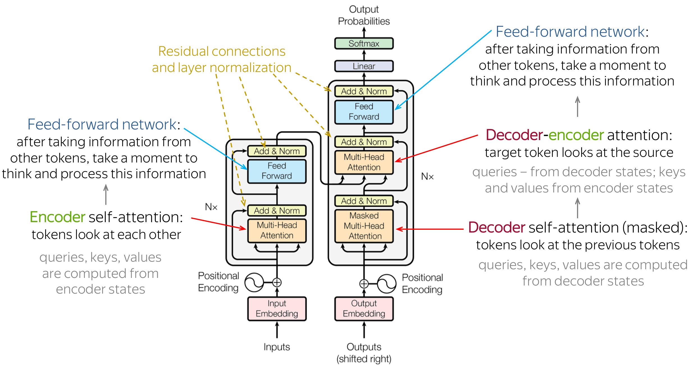

# Transformers

# What are Transformers?

- A transformer model is a type of neural network used in machine learning that is particularly well-suited for tasks such as natural language processing (NLP)
    - It processes data in a way that enables it to understand the relationships between different elements of a sequence, such as the words in a sentence
    - This makes it very effective for tasks such as language translation, sentiment analysis, and question answering
- Transformers were introduced in this 2017 [paper](https://proceedings.neurips.cc/paper/2017/file/3f5ee243547dee91fbd053c1c4a845aa-Paper.pdf) as a tool for sequence transduction—converting one sequence of symbols to another
- The Transformer architecture addressed the issue of preserving **long-term dependencies** by leveraging
    - S**elf-Attention** mechanisms to retain word-to-word relation and
    - **Positional Encodings** to represent each word’s position
        - This enables **parallel** computation over the entire text without disrupting the order. The Transformer has an **encoder** for input text and a **decoder** for generating text
- Encoder-decoder models (also called *sequence-to-sequence models*) use both parts of the Transformer architecture
    - At each stage, the attention layers of the encoder can access all the words in the initial sentence, whereas the attention layers of the decoder can only access the words positioned before a given word in the input
    - A sequence-to-sequence model is a model that takes a sequence of items (words, letters, features of an images…etc) and outputs another sequence of items

# How does it work?

- The encoder processes each item in the input sequence, it compiles the information it captures into a vector (called the context)
    - The context is a vector (an array of numbers, basically) in the case of machine translation. The encoder and decoder tend to both be recurrent neural networks
        - You can set the size of the context vector when you set up your model. It is basically the number of hidden units in the encoder RNN
    - To transform a word into a vector,
- After processing the entire input sequence, the encoder sends the context over to the decoder, which begins producing the output sequence item by item

# Types of Transformer Models

- **Auto-Regressive Models**
- **Auto-Encoding Models**
- **Sequence-to-Sequence Models**

# General Architecture

The model is primarily composed of two blocks:

- **Encoder (left)**: The encoder receives an input and builds a representation of it (its features)
    - This means that the model is optimized to acquire understanding from the input

- **Decoder (right)**: The decoder uses the encoder’s representation (features) along with other inputs to generate a target sequence
    - This means that the model is optimized for generating outputs

Each of these parts can be used independently, depending on the task:

- **Encoder-only models**: Good for tasks that require understanding of the input, such as sentence classification and named entity recognition
- **Decoder-only models**: Good for generative tasks such as text generation
- **Encoder-decoder models** or **sequence-to-sequence models**: Good for generative tasks that require an input, such as translation or summarization

# Stages

1. **Word Embeddings:** The first stage of the Transformer is to convert the input text into a sequence of vectors. This is done using an embedding layer, which maps each word in the vocabulary to a unique vector
    1. The output of this stage is a sequence of vectors, one for each word in the input
    2. Word embeddings give us a way to use an efficient, dense representation in which similar words have a similar encoding. Importantly, you do not have to specify this encoding by hand

    [Word Embeddings](./Transformers/Word%20Embeddings.md)

2. **Positional Encodings:** The next step is to inject positional information into the embeddings
    1. Because the transformer encoder has no recurrence like recurrent neural networks, we must add some information about the positions into the input embeddings. This is done using positional encoding
    2. The Transformer doesn’t inherently understand the order of the words in the sentence. To address this, positional encodings are added to the embeddings
        1. These are a set of sinusoidal functions that provide information about the position of each word in the sentence
        2. The output of this stage is a sequence of vectors that contain both the word’s meaning and its position in the sentence

        [Positional Encoding](./Transformers/Positional%20Encoding.md)

3. **Encoder:** The encoded vectors are then passed through a series of identical layers in the encoder. Each layer has two sub-layers:
    1. A multi-head self-attention mechanism
    2. A simple, position-wise fully connected feed-forward network
    - **Multi-Head Self-Attention:** This mechanism allows the model to focus on different parts of the input sentence for each word
        - It computes a weighted sum of the input vectors, where the weights are determined by the attention scores
        - The attention scores are computed using a softmax function applied to the dot product of the input vectors
            - This process is done multiple times (or “heads”) in parallel, allowing the model to capture different types of relationships between the words
    - **Feed-Forward Network:** After the self-attention mechanism, the vectors are passed through a feed-forward network, which consists of two linear transformations with a ReLU activation in between
        - This network doesn’t change the dimension of the vectors, so the output of this stage is still a sequence of vectors, one for each word in the input
        - Linear Layer learns to do whatever is necessary to make this new jumbled up set of embeddings ready for the next stage
4. **Decoder:** The output of the encoder is then passed to the decoder, which also consists of a series of identical layers
    1. Each layer in the decoder has three sub-layers: a multi-head self-attention mechanism, a multi-head attention mechanism over the output of the encoder, and a feed-forward network
    2. The decoder generates the output text one word at a time, using the encoder’s output and its own previous outputs as input
5. **Output Linear Layer and Softmax:** The final stage of the Transformer is a linear layer followed by a softmax function
    1. The linear layer transforms the output of the decoder into a set of scores, one for each word in the vocabulary
    2. The softmax function then converts these scores into probabilities, and the word with the highest  probability is chosen as the output for the current position

# Self-Attention Layers

- A key feature of Transformer models is that they are built with special layers called *attention layers*
    - Self-attention calculates **attention scores** between different sentence parts, enabling selective focus on the most relevant dependencies
- Self-attention is the method the Transformer uses to bake the “understanding” of other relevant words into the one we’re currently processing
    1. As the model processes each word (each position in the input sequence), self attention allows it to look at other positions in the input sequence for clues that can help lead to a better encoding for this word
    2. **Steps:**
        1. The **first step** in calculating self-attention is to create three vectors from each of the encoder’s input vectors (in this case, the embedding of each word)
            1. So for each word, we create a Query vector, a Key vector, and a Value vector. These vectors are created by multiplying the embedding by three matrices that we trained during the training process
        2. The **second step** in calculating self-attention is to calculate a score
            1. Say we’re calculating the self-attention for the first word in this example, “Thinking”. We need to score each word of the input sentence against this word
            2. The score determines how much focus to place on other parts of the input sentence as we encode a word at a certain position
        3. Normalization and Softmax

[Attention & Self-Attention](./Transformers/Attention%20&%20Self-Attention.md)

# Architecture Differences

## Difference Between Encoder and Decoder Block in a Transformer

- The main difference is that ***encoders are designed to learn embeddings*** that can be used for various predictive modeling tasks such as classification. In contrast, ***decoders are designed to generate new texts***, for example, answering user queries
- Another key difference is that the Transformer encoder uses ***bi-directional self-attention***, whereas the ***decoder uses uni-directional self-attention layer instead***

# Transformer Components & Stages

## Embeddings

## Residuals

[Residuals](./Transformers/Residuals.md)

## Layer Normalization

[Layer Normalization](./Transformers/Layer%20Normalization.md)

## Positional Encoding

[Positional Encoding](./Transformers/Positional%20Encoding.md)

## Encoder Block Internals

[Encoder Block Internals](./Transformers/Encoder%20Block%20Internals.md)

## Decoder Block Internals

[Decoder Block Internals](./Transformers/Decoder%20Block%20Internals.md)

# Transformer Models

- [Bidirectional Encoder Representations from Transformers (BERT)](./Transformers/Bidirectional%20Encoder%20Representations%20from%20Transformers.md)

- [Generative Pretrained Transformer (GPT)](./Transformers/Generative%20Pretrained%20Transformer%20(GPT).md)

# Loss

---

- To compute loss, only look at the masked position(s)
- Compute KL-divergence between each predicted token $\hat y_{masked}$ and the actual token $\hat y_{masked}$

# Transformer Code Analysis

- [Github Tutorial](https://github.com/markriedl/transformer-walkthrough)

# Key Concepts

---

- **Masked Language Modelling (MLM):** MLM is a pre-training technique used in Natural Language Processing (NLP)
    - [The process involves randomly masking a portion of the input tokens in a sentence and asking the model to predict the masked tokens](https://medium.com/@lokaregns/masked-language-modeling-with-hugging-face-transformers-a-beginners-guide-b36af74a7560)
        - [This is done by masking some of the words in the input text and training the model to predict the masked words based on the context of the non-masked words](https://www.scaler.com/topics/nlp/masked-language-model-explained/)
    - [MLM is great for tasks that require a good contextual understanding of an entire sequence](https://huggingface.co/docs/transformers/main/tasks/masked_language_modeling)
        - [It allows the model to consider both past and future tokens when making predictions](https://medium.com/@tom_21755/understanding-causal-llms-masked-llm-s-and-seq2seq-a-guide-to-language-model-training-d4457bbd07fa)

# Resources

- [Annotated Transformer](https://nlp.seas.harvard.edu/2018/04/03/attention.html)
- [https://jalammar.github.io/illustrated-transformer/](https://jalammar.github.io/illustrated-transformer/)
- [https://lena-voita.github.io/nlp_course/seq2seq_and_attention.html](https://lena-voita.github.io/nlp_course/seq2seq_and_attention.html)
- [https://kikaben.com/transformers-encoder-decoder/](https://kikaben.com/transformers-encoder-decoder/)
- [https://www.youtube.com/watch?v=phOc25QfNS0](https://www.youtube.com/watch?v=phOc25QfNS0)
- [https://towardsdatascience.com/illustrated-guide-to-transformers-step-by-step-explanation-f74876522bc0](https://towardsdatascience.com/illustrated-guide-to-transformers-step-by-step-explanation-f74876522bc0)
- [https://towardsdatascience.com/transformers-in-depth-part-1-introduction-to-transformer-models-in-5-minutes-ad25da6d3cca](https://towardsdatascience.com/transformers-in-depth-part-1-introduction-to-transformer-models-in-5-minutes-ad25da6d3cca)
- [https://medium.com/@yulemoon/detailed-explanations-of-transformer-step-by-step-dc32d90b3a98](https://medium.com/@yulemoon/detailed-explanations-of-transformer-step-by-step-dc32d90b3a98)
-

### Word Embeddings

- [https://www.tensorflow.org/text/guide/word_embeddings](https://www.tensorflow.org/text/guide/word_embeddings)
- [https://e2eml.school/transformers.html#embeddings](https://e2eml.school/transformers.html#embeddings)

**Positional Encodings**

- [https://kazemnejad.com/blog/transformer_architecture_positional_encoding/](https://kazemnejad.com/blog/transformer_architecture_positional_encoding/)

### Tutorials

- [Harvard NLP: The Annotated Transformer](https://nlp.seas.harvard.edu/2018/04/03/attention.html)
- [NLP Class Transformer Walkthrough](https://github.com/markriedl/transformer-walkthrough)
- [Step-By-Step Illustrated Explanation](https://towardsdatascience.com/illustrated-guide-to-transformers-step-by-step-explanation-f74876522bc0)
- [Seq2Seq: Attention & Transformer](https://lena-voita.github.io/nlp_course/seq2seq_and_attention.html)

### Blogs

- [Understanding the Attention Mechanism in Sequence Models](https://www.jeremyjordan.me/attention/)
- [Step By Step Illustrated Explanation Transformer](https://medium.com/the-modern-scientist/detailed-explanations-of-transformer-step-by-step-dc32d90b3a98)
-

### Encoders & Decoders

- [https://magazine.sebastianraschka.com/p/understanding-encoder-and-decoder](https://magazine.sebastianraschka.com/p/understanding-encoder-and-decoder)
- [https://kikaben.com/transformers-encoder-decoder/#decoder-block-internals](https://kikaben.com/transformers-encoder-decoder/#decoder-block-internals)