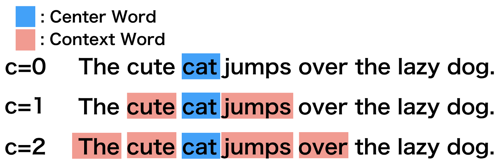

# Embeddings

# What are they?

- Word embeddings are a technique for identifying similarities between words in a corpus by using some type of model to predict the co-occurence of words within a small chunk of text
- Word embeddings are numerical representations of words in a continuous vector space, where semantically similar words are closer together
    - These representations capture the semantic relationships and contextual information of words based on their usage in a given context

# How do they work?

- **Word Representation:**
    - In traditional approaches, words are often represented using discrete symbols or one-hot vectors, where each word is assigned a unique index in a high-dimensional space
        - However, these representations lack semantic information and struggle to capture relationships between words
- **Continuous Vector Space:**
    - Word embeddings map words to continuous vector spaces, typically with lower dimensions (e.g., 50, 100, 300 dimensions)
        - Each word is represented by a dense vector of real numbers
- **Distributional Hypothesis:**
    - Word embeddings are based on the distributional hypothesis, which posits that words appearing in similar contexts have similar meanings
        - Therefore, words with similar meanings should be close together in the vector space
- **Training:**
    - Word embeddings are learned through unsupervised training on large corpora of text
    - The model learns to predict the context of a word (context prediction task) or predict the target word given its context (skip-gram or continuous bag-of-words models)
- **Context Window:**
    - In the training process, a context window is used to define the context of a word
    - The model learns to associate words that frequently appear together within this context window.
- **Training Objective:**
    - The training objective is to minimize the difference between the predicted and actual context of words
    - This process adjusts the word embeddings to capture the distributional properties of the words in the corpus
- **Semantic Relationships:**
    - After training, word embeddings are capable of capturing semantic relationships
    - Words with similar meanings or usage tend to have similar vector representations, and relationships between words (e.g., "king" - "queen" ≈ "man" - "woman") can be expressed as vector operations

# Context Window

- Word embeddings are created by identifying the words that occur within something called a “Context Window”
    - The context window is defined by a string of words before and after a focal or “center” word that will be used to train a word embedding model
    - Each center word and context words can be represented as a vector of numbers that describe the presence or absence of unique words within a dataset, which is perhaps why word embedding models are often described as “word vector” models, or “word2vec” models
- The Figure below illustrates context windows of varied length for a single sentence

    

# Types of Embedding Models

- Word embeddings are usually performed in one of two ways:
    1. “Continuous Bag of Words” (CBOW)
        1. The CBOW model reads in the context window words and tries to predict the most likely center word
    2. “Skip-Gram Model”
        - The Skip-Gram Model predicts the context words given the center word
- The examples above were created using the Skip-Gram model, which is perhaps most useful for people who want to identify patterns within texts to represent them in multimensional space, whereas the CBOW model is more useful in practical applications such as predictive web search
- The figure below illustrates the differences between the two models:

    

# CBOW Vs. Skip Gram

- CBOW: Can a word be predicted based on the surrounding words?

    

    - Loss is the cross-entropy of the probability distribution over words
- Skip Gram: Can a window of words be predicted based on the word in the middle of the window?

    

    - The idea here is that we should be able to think about every word in the window independently regardless of exactly where they are
    - Break up into skip-grams (bigrams on non-adjacent tokens)
    - Predict each skip-gram separately

# Why This Works?

- One-hot for the $i^{th}$ word selects a set of $d$ weights and all others are zeroed out
- These remaining weights are a $d$-dimensional representation of the indexed word
- Because we are multiplying $1$s and $0$s, the $d$ weights $W_i$ are identical to the $d$-dimensional vector of activations at the next layer up

# Connection to Neural Networks

- We call the linear compression layer in the encoding the ***embedding layer***
    - Token to One-Hot Vector
    - Linear from length $|V|$ to $d$ length vector
- Whatever reduces loss in the output probability
    - Must make compromises
    - We hope these compromises map similar words to similar vectors
        - No guarantee
- The ***Embedding layer is task specific***
- **Key Question:** Can we learn a general set of embeddings?
- Each row is an embedding for a different token in the vocabularly

# Common Embedding Models

- NLP GloVe
- [Word2Vec](/Course%20Notes/Module%205%20Semantics/word2vec/Word2Vec.md)

# Common Embedding Use Cases

- Regression and Classification
- Document Clustering

# Resources

- [https://rcpedia.stanford.edu/topicGuides/textProcessingWord_Embeddings.html](https://rcpedia.stanford.edu/topicGuides/textProcessingWord_Embeddings.html)
- [https://e2eml.school/transformers.html#embeddings](https://e2eml.school/transformers.html#embeddings)

### Tutorials & Blogs

- [https://cbail.github.io/textasdata/word2vec/rmarkdown/word2vec.html](https://cbail.github.io/textasdata/word2vec/rmarkdown/word2vec.html)
- [https://neptune.ai/blog/word-embeddings-guide](https://neptune.ai/blog/word-embeddings-guide)

### CBOW & Skip Grams

- [https://fasttext.cc/docs/en/unsupervised-tutorial.html](https://fasttext.cc/docs/en/unsupervised-tutorial.html)
- [https://www.baeldung.com/cs/word-embeddings-cbow-vs-skip-gram](https://www.baeldung.com/cs/word-embeddings-cbow-vs-skip-gram)

### PyTorch

- [https://pytorch.org/tutorials/beginner/nlp/word_embeddings_tutorial.html](https://pytorch.org/tutorials/beginner/nlp/word_embeddings_tutorial.html)