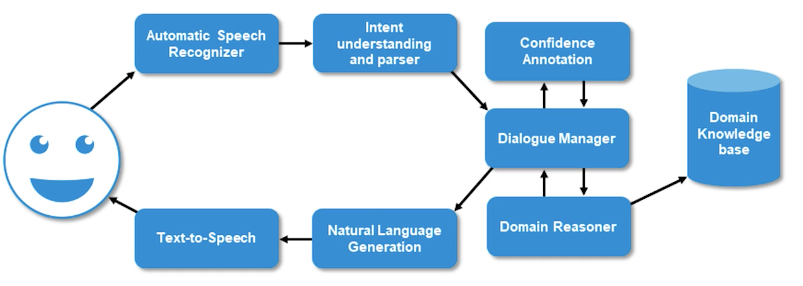

# Module 8: Task Oriented Dialogue

# What is it?

- Understanding user utterances to perform a task such as providing information, manipulation of objects, navigating to a specific location
- Generating response to user requests in a consistent and coherent manner while maintaining dialog history
- Managing user and system turns effectively and recovering from errors from potential misunderstanding or non-understanding
- Engaging the user with adaptive and interesting conversations while progressing towards the common goal

# Why is it Challenging?

- Context of the dialog history is paramount to achieving task success
- Ability to capture back and forth interaction, estimate the belief state of user goals
- Piece together the relevant and necessary information needed to complete the task
- Domain specific nature of the dialogue makes it harder for adaptation and generalization
- API calls to web services may change over time and require frequent maintenance of the dialogue managers

# Characteristics

1. **Turn Taking**
    1. Dialogue is often interleaved between at least two speakers (including agent)
    2. Speakers holds the floor for a given time and takes opportunity to speak/inform or request
2. **Speech Acts**
    1. Assertives: Speaker suggests or puts forward information to the agent
    2. Directives: Speaker acts or requests information from the agent
    3. Commissives: Speaker agrees or opposes the agent
    4. Expressives: Greets the agent
3. **Grounding**
    1. Whether the user and agent mutually believe or agree on set of information exchanged
    2. Agent or user acknowledge each others information

# Architecture

# Automatic Speech Recognition

- User utterances are automatically endpointed for speech segments
- Accoustic features are computed from the speech segments and treated as a sequence of observations
    - The sequence is further translated to phonemic sequences where each subsequence of feature represent a phoneme or triphone
- Phonemic representation is further translated or decoded to subwords or words conditioned by the language model

## System Overview

- Acousitc features: traditionally Mel-Frequency Cepstral Coefficient
- Acoustic Model: Discriminative model either speaker dependent or speaker independent model to realize the phoneme / subphone sequences based on the acoustic features
- Lexico or Pronounciation Model: Provides staistical information on how tokens or words in a language or pronounced
- Language Model: Provides statistical information on token-level transitions in a given language

# Natural Language Understanding

- There are 3 key steps in NLU:
    1. Intent Prediction: Users Goal
        1. I.e. Information seeking, clarification, etc.
    2. Slot Filling: Slots that are relevant to the task viz
        1. I.e. Inputs needed to complete task
    3. State Tracking: estimated user goals and probability distributions

## Intent Prediction

- Intent prediction refers to extraction of semantics from natural language to determine the user goals during the dialog
- Converting speech recognition to output to a semantic representation task is challenging:
    - ASR errors are prevalent in task-oriented settings
    - Ambiguity in natural language
    - Synonyms in natural language are another bottleneck

# Natural Language Generation

- Typically takes two forms:
    1. User Initiated Dialogue
    2. System Initiated Dialogue

# Dialogue Manager

- **Goal:** Orchestrates the content and structure of the dialogue
- **Tasks:**
    - Processes the input from ASR and NLU
    - Tracks the history and the context of dialogue in the form of a state
    - Exchanges information back-and-forth with domain reasoner
    - Broadcasts relevant information to user via NLG and TTS
    - Dialogue managers often utilize a data structure for storing the context and task relevant information
    - Dialogue state tracking is a mechanism to update the data structure and keep the conversation on track
- **Task Tree:**
    - Finite State Automation: Handcrafted dialogue task tree with fixed transitions between dialogue states
    - System typically initiates the dialogue and controls the flow in a rigid fashion based on a series of questions
    - System may have difficulty recovering from non-understanding errors
    - Good for small and limited domain dialogues and rapid prototyping
- **Frames:**
    - Slots and slot types are filled based on the questions posed to the user
        - I.e. Restaurant name, reservation time, cusine type, etc.
    - Slot types can be hierarchical in nature, thus complex dialogues are performed via tree-like dialogue state transitions
    - Allows multi-domain, multi-intent dialogues with slots tied to an intent
- **Dialogue State Tracking**
    - A state consists of dialogue history:
        1. User requests + information + slots provided so far
        2. Information requested and provided by the system
        3. User preferences
    - **Types**
        - Handcrafted - Replace values per slot with latest information
        - Probabilistic - Maintain distribution of values per slot
- **Dialogue Policy**
    - Decision on next action given the current dialogue state
    - Every system action is determined by the hand-crafted or trained policy given the dialogue history
    - **Handcrafted**
        - If-then-else clauses or Flowcharts
    - **Statistical**
        - Trained user RL algorithms
        - Popularly using POMDP’s

# End-To-End Task Oriented Dialogue System

- **Intent Network:** Seq2Seq model as encoder
- LSTM’s, CNN’s, etc.
- **Belief Tracking:** Map input distribution of values
    - Belief tracker per slot
    - Output: Slot values with probability scores
    - **Database Operator:** Most likely value out of informable slots and a SQL query is generated
        - Assign a {0,1} vector over fields in the DB
- **Policy Network:** Feedforward layer to bind the gradients together
- **Generation Network:** Generate auto-regressive Seq2Seq

# Error Recovery in Dialogue

- **Misunderstanding Vs. Non-Understanding Errors**

    

## Recovering Strategies

- **Recover reliable information**
    - Explicit: Did you say?
    - Implicit Confirmation: I heard…
    - Disambiguation A or B?
    - Repeat: Can you tell me again?
- **Dialogue is on track and advancing**
    - Rephrase: Could you say differently?
    - Reformulation: You meant…what?
    - Help: I can help you with ….
- **Task Completion**
    - Restart: Let’s try this again
    - Something else: I can help differently
    - Terminate Sorry, I can’t finish at this time

# Evaluation & Benchmarks

- Human ratings such as Likert scale, single-turn or multi-turn evaluation are more suitable for overall interaction quality
- Multi-reference evaluations often require denoising of ratings, and higher inter-annotator agreement

## Dialogue Evaluation Metrics

- Overall empirical metrics are typically:
    - Task success
    - Number of dialogue turns
    - Slot error rate / accuracy
- NLU evaluation could be further broken down into:
    - Slot level F1, Intent Prediction Accuracy
    - Belief State or dialogue state rewards are also computed
- NLG evaluation can be very nuanced — effective yet natural
    - BLEU, METEOR scores measure response against references
    - Slot Error rate or information accuracy towards goal completion

# Terminology

- **Domains:** Weather, Flights, Restaurants, E-Commerce
- **Intents:** Ask Flight Time, Book a Flight, Change Arrival
- **Slots:** Arrival Location, Departure Location, Arrival Time, Departure Time

# Resources

- [Princeton Slides](https://www.cs.princeton.edu/courses/archive/spring20/cos598C/lectures/lec16-task-oriented-dialogue.pdf)