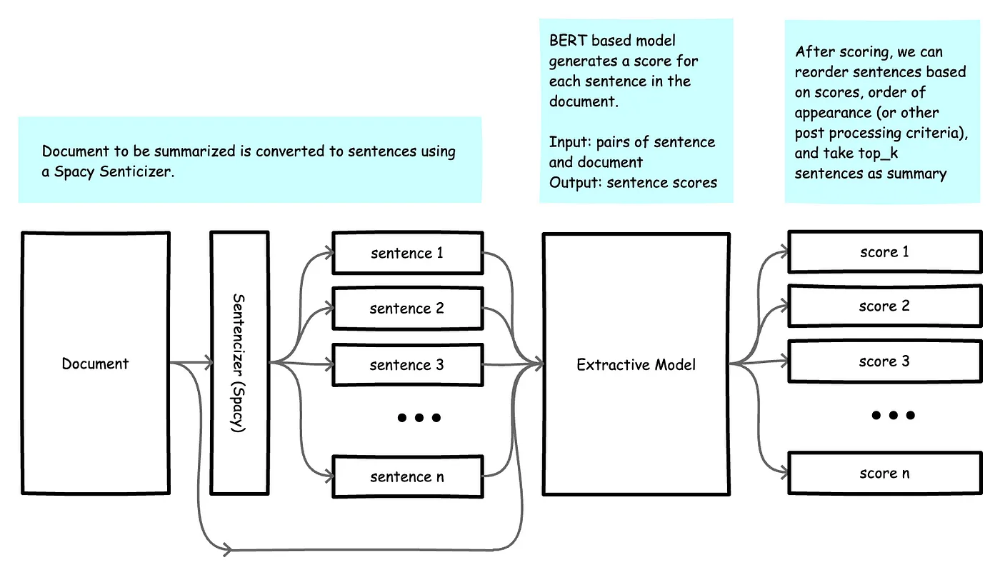

# Module 9: Applications Summarization

# What is it?

- Text summarization is the process of generating short, fluent, and most importantly accurate summary of a respectively longer text document
- ***The main idea*** behind automatic text summarization is to be able to find a short subset of the most essential information from the entire set and present it in a human-readable format

# What Makes a Good Summarization?

1. **Faithfulness**
    - Is the summary staying true to the facts?
2. **Relevance**
    1. Capture the most ***informative*** pieces
3. **Coherent (Cohesive)**
    1. Sentences are natural and tell a smooth smoothy

# Extractive Vs. Abstractive Summarization

- **Extractive summarization** involves identifying important sections from text and generating them verbatim which produces a subset of sentences from the original text
    - It extracts important sentences or words without any modification and rearranges them in grammatically order to make sense out of it
    - Most summarization approaches today are extractive in nature
    - **Pros:** Guaranteed to be faithful
    - **Cons:** It can be redundant and may lack coherence

        

- **Abstractive summarization** uses natural language techniques to interpret and understand the important aspects of a text and generate a more “human” friendly summary
    - This approach is definitely more appealing, but much more difficult than extractive summarization
    - **Pros:** The summaries are often coherent and grammatical
    - **Cons:** Faithfulness can be an issue (i.e. hallucination)
- **Extractive-Abstractive Methods**
    - Useful for long documents

# Evaluation

- **Generative tasks are hard to evaluate:**
    - Translation, Summarization, Data2Text
    - ***Summarization can be difficult***, as the space of acceptable summaries can be large
- **Faithfulness is hard to measure**
    - Same words but different ordering can make it unfaithful
    - **Relevance** can be subjective
- To avoid some of the issues with ROUGE we can look at:
    - **BERT-Score:** Use a pre-trained BERT to compare the contextual cosine similarity between the tokens in the candidate and reference
    - **BART-Score:** Use a BART model to obtain the probability of the candidate given the original document (also has other variants)

## Automatic Metrics

- [Bilingual Evaluation Understudy (BLEU)](./Bilingual%20Evaluation%20Understudy%20(BLEU).md)
- [ROUGE](./ROUGE.md)

# Neural Abstractive Summarization

- **Sequence-to-Sequence (Seq2Seq) Models**:
    - Neural abstractive summarization often relies on **sequence-to-sequence** models, which consist of an **encoder** and a **decoder**
    - The **encoder** processes the input text (e.g., a news article) and encodes it into a fixed-length vector representation
    - The **decoder** then generates the summary based on this representation
- **Attention Mechanism**:
    - Seq2Seq models use an **attention mechanism** to focus on relevant parts of the input during decoding
    - Attention helps the model weigh different words or phrases in the input when generating each word of the summary
    - This allows the model to capture context and produce more accurate and contextually relevant summaries
- **Word Generation**:
    - During decoding, the model generates words one by one
    - At each step, it predicts the next word based on the context (encoded representation) and the previously generated words
    - The decoder uses a **softmax layer** to compute the probability distribution over the vocabulary for the next word
- **Challenges**:
    - Abstractive summarization is challenging because it requires understanding context, paraphrasing, and generating coherent sentences
    - Models must strike a balance between fidelity to the source text and producing concise summaries

## Point Generator Networks

- [Point Generator Networks](./Point%20Generator%20Networks.md)

## BertSum

- [BertSum](./BertSum.md)

# Hallucination in Summarization

- Coherence, naturalness and grammatical errors are not the issue when using a pre-trained LM
- The biggest problem with deploying an ***Abstractive Summarization*** model is the possibility of hallucination (being unfaithful to the original content)
    - Change the facts
    - Add facts from the LM intrinsic knowledge
- Many automatic techniques have been introduced such as using:
    - **NLI:** The candidate should be entailed from the original document
    - **QA:**
        - Generate Q’s from the candidate
        - The candidate should provide the same answers as the original document
    - Bartscore

# Resources

### Metrics

### Blogs

- [https://medium.com/analytics-vidhya/text-summarization-using-nlp-3e85ad0c6349](https://medium.com/analytics-vidhya/text-summarization-using-nlp-3e85ad0c6349)