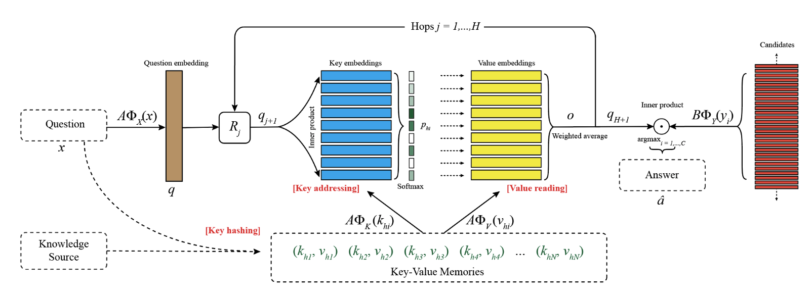

# CS7650-NLP
This repository contains my course notes and course summary from Natural Language Processing (OMS CS7650)

## Course Resources
- [OMSCS Course Page](https://omscs.gatech.edu/cs-7650-natural-language-processing)
- [NLP Textbook](https://github.com/jacobeisenstein/gt-nlp-class/blob/master/notes/eisenstein-nlp-notes.pdf)

## Course Summary
This course gives an overview of modern data-driven techniques for natural language processing. The course moves from shallow bag-of-words models to richer structural representations of how words interact to create meaning, including neural language models. During the course of the project, we had 4 HW assignments, one project, a midterm report and an exam.

CS7650 gives an excellent introduction to a wide array of topics within the NLP space. The course covers the following topics:

- [Module 2: Foundations](./Course%20Notes/Module%202%20Foundations/Module%202%20Foundations.md)
- [Module 3: Classification](./Course%20Notes/Module%203%20Classification.md)
- [Module 4: Language Modelling](./Course%20Notes/Module%204%20Language%20Modelling/Module%204%20Language%20Modelling.md)
- [Module 5: Semantics](./Course%20Notes/Module%205%20Semantics.md)
- [Module 6: Modern Neural Architectures](./Course%20Notes/Module%206%20Modern%20Neural%20Architectures/Module%206%20Modern%20Neural%20Architectures.md)
- [Module 7: Information Retrieval](Natural%20Language%20Processing%20(NLP)%20f2275cd8c5894e6a98d85f3fe5d88df9/Module%207%20Information%20Retrieval%2064cde313808443d6958aa4bc878d2ed4.md)
- [Module 8: Task Oriented Dialogue](Natural%20Language%20Processing%20(NLP)%20f2275cd8c5894e6a98d85f3fe5d88df9/Module%208%20Task%20Oriented%20Dialogue%203726c084e355492797d4d40f2451f7d8.md)
- [Module 9: Applications Summarization](Natural%20Language%20Processing%20(NLP)%20f2275cd8c5894e6a98d85f3fe5d88df9/Module%209%20Applications%20Summarization%204c29cf0649ad41a396a51633ee92ad85.md)
- [Module 10: Machine Reading](Natural%20Language%20Processing%20(NLP)%20f2275cd8c5894e6a98d85f3fe5d88df9/Module%2010%20Machine%20Reading%20c7e8e3a012ff4727bd0742f90e975da3.md)
- [Module 11: Open-Domain Question Answering](Natural%20Language%20Processing%20(NLP)%20f2275cd8c5894e6a98d85f3fe5d88df9/Module%2011%20Open-Domain%20Question%20Answering%20a96af23c143c4ffe92e128061cc2b69a.md)
- [Module 12: Machine Translation](Natural%20Language%20Processing%20(NLP)%20f2275cd8c5894e6a98d85f3fe5d88df9/Module%2012%20Machine%20Translation%20205e8d530da84fac9efa49dc87cf5166.md)
- [Module 13: Privacy-Preserving NLP](Natural%20Language%20Processing%20(NLP)%20f2275cd8c5894e6a98d85f3fe5d88df9/Module%2013%20Privacy-Preserving%20NLP%209ed24faa5b724468a708256b2a1c504b.md)

## Project Summaries

### HW1
The first homework assignment was a simple introduction to PyTorch and required to us to build a small neural network. The task was to build a network which predicted the direction and whether to accelerate or stop for a simplified self driving car example. This assignment helped show us how to build in PyTorch, work with batch data and write a training and testing loop

### HW2
In HW2, we were tasked with building a few neural classification models, again using PyTorch. Primarily, we looked at Logistic Regression, Naive Bayes for classifying sentiment of movie reviews. We built the Naive Bayes model from scratch where we created a bag of words as our feature space and computed the positive and negative label probabilties: $P(L_{+}|\phi_{0:|V|}) = P(\phi_{0:|V|}|L_{+})P(L_{+}) / P(\phi_{0:|V|})$. We then simply took the probability of a positive label - the probability of a negative label as our prediction class. Lastly, we built a multinomial logistic regression model to classify topics within a news dataset using a small neural network using a combination of Linear and Tanh layers. For this problem, we utilized glove word embeddings to reduce our feature size from 1 x vocab size to embedding_size.

### HW3A
For HW3, we were given a corpus of text data and asked to write an RNN from scratch to genrate text. The RNN takes in a one-hot vector for a single word and a hidden state vector (initially all zeroes), compresses it to a hidden state, and then decompresses it. The decompressed word is tested against the **next** word in the training sequence using cross-entropy loss. The RNN also produces the hidden state vector to pass in with the next word in the training sequence. The neural network must guess the next word as well as learn to create a hidden state vector that helps the next iteration make a better word guess. The goal here was to create a simplified language model which attempts to approximate the underlying statistics of a text corpus $P(tok_n | tok_1, tok_2, ..., tok_{n-1}; \theta)$ where $\theta$ is a set of learned parameters/weights. We were also instructed to create a training and testing loop which utilized *teacher forcing* to help with training.

### HW3B
For HW3B, we were asked to create an LSTM from scratch to train on the same text corpus from the previous homework. This involved us writing the cell, input, forget and cell memory components by hand. Again, we were also required to build the training/testing loops using teacher forcing. We used generative sampling techniques such as temperature to retireve the most likely next token at some time step $t$.

### HW4
HW4 was focused on implementing the Word2Vec algorithm using the Continuous Bag-of-Words and Skipgram approaches from scratch. In order to do this, we needed to construct our vocabularly and create onehot vectors for each token (word). For both models, part of the work involved created our training/testing sets, making sure each vector has the same size, creating special Unknown tokens if the words are not in our vocabularly and capping the max length. I used PyTorch networks for both models as they are quite similar where the critical difference lies in how we prepare our training and testing data.

### HW5 - Final Class Project
The final project revolved around implementing a reserach paper focused on a Question-Answering system architecture which contained an attention mechanism. The specific research paper named Key-Value Memory Networks for Directly Reading Documents can be found [here](https://arxiv.org/abs/1606.03126). The architecture for this type of network looks like this:

The basic idea of the Key-Value Memory Network is:

1. **Key Hashing**
    1. The question can be used to preselct a small subset of the possibly large array of keys
    2. Find keys that share at least one word with the question

2. **Key Addressing**
    - When a question is posed, the KV-MemNN performs the following steps:
        - **Embedding**: The input question is converted into an internal feature representation (embedding)
        - **Hashing**: Further processing is applied to the embedded question.
        - **Attention Mechanism**:
            - The KV-MemNN computes an **attention score** for each key in the memory
            - The attention score reflects how relevant each key is to the current question
            - Keys that are more relevant receive higher attention scores
    - **Weighted Sum (Attention Mechanism)**:
        - The values corresponding to the keys are combined using the attention scores
        - This weighted sum of values serves as the predicted answer
        - Essentially, the KV-MemNN “reads” the memory by focusing on the most relevant keys
    1. Each candidate memory is assigned a relevance probability by comparing the question to each key:

        $$
        p_{h_i} = \text{Softmax}(A \Phi_X(x)) \space \cdot \space A \Phi_K(k_{h_i}))
        $$

        - Where:
            - $\Phi$ represents the embedding dimensions (i.e. features)
            - $A$ is a $d \times D$ matrix
3. **Value Reading**
    1. The values of the memories are read by taking their  weighted sum using the addressing probabilities and the vector $o$ is returned:

        $o = \sum_i p_{h_i} A \Phi_V(v_{h_i})$

        - The memory access process is conducted by the controller network using $q = A \Phi_X(x)$ as the query
        - After receiving the result $o$, the query is updated with $q_2 = R_1(q+o)$ where $R$ is a $d \times d$ matrix
        - The memory access is then repeated (only the addressing and reading steps, not hashing), using a different matrix $R_j$ on each hop, $j$

### Midterm Report
The midterm report we could choose to analyze one of a few possible research papers. I choose the paper [Chain-of-Thought Prompting Elicits Reasoning in Large Language Models](https://arxiv.org/pdf/2201.11903) because I found this extremely relevant in todays times. I found it fascinating how we could utilize LLM's in different ways to improve their performance on various tasks, especially in commonsense reasoning. I also was very curious as to why this happens for foundational LLM's.

# Questions?

If you are a potnetial employer looking at this, I would be more than happy to share my work on the above assignments from this class. I cannot post my class code here due to the GT honor code.